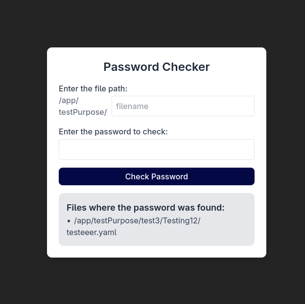
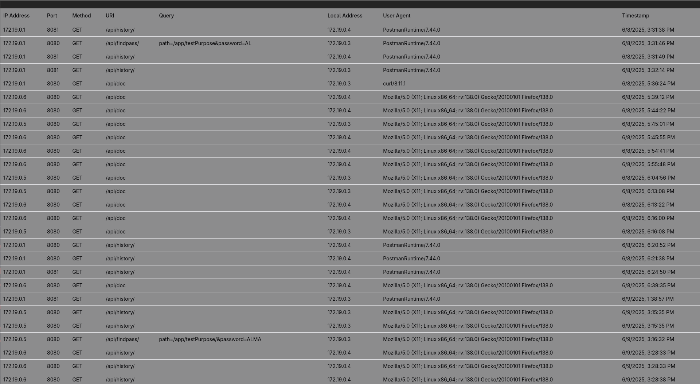
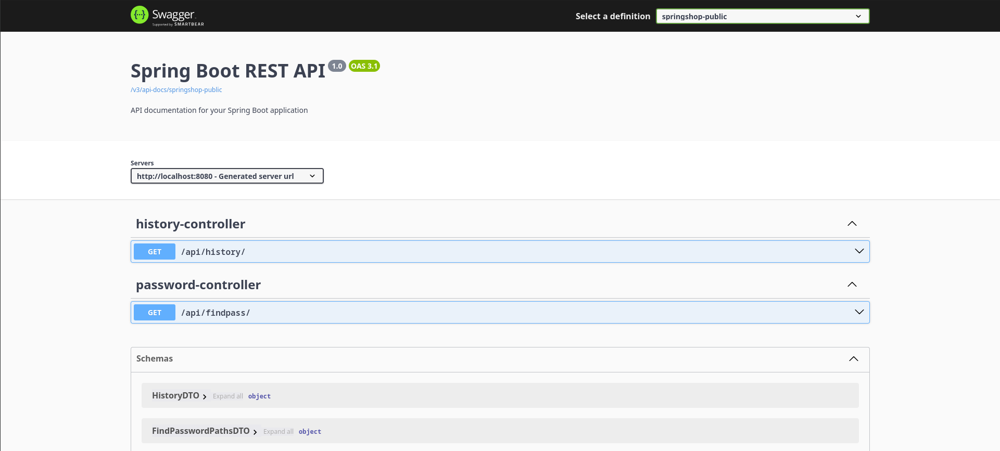

# PasswordChecker-App
Pass-Checker App is a **password security and lookup tool** designed to quickly check for strings within a mounted file.  

### How It Works  
  - The user **mounts a file**.  
  - The application **reads from the mounted file** and performs fast lookups.  
  - The results are displayed instantly to the user.  


## Getting Started  

### Prerequisites  

#### Environment Variables  
Create an `.env` file **in the root directory of the project** with the following key-value pairs:  

```bash
DATASOURCE_USERNAME=your_datasource_username
DATASOURCE_PASSWORD=your_datasource_password
DATASOURCE_URL=your_datasource_url
DIRECTORY_FOR_CHECK=path_for_your_directory_you_want_to_mount
```

## Installation  

### 🔹 Clone the repository  
```bash
git clone git@github.com:Vazul15/PasswordChecker-App.git
```

### 🔹 Build and Run the application
```bash
make build
```


## Demo Screenshots / USAGE

### Directory-Based Password Lookup  
Simply specify the directory name within the mounted directory, and the application will search for the given password within that location.  
  

### History View  
Get detailed insights into backend access, including user activity, originating IP addresses, and access history logs.  
  

### API Documentation  
Comprehensive documentation is available for backend API calls, ensuring seamless integration and usage.  
  


---

##  Used Technologies  

### **Frontend**  
- [](https://reactjs.org/)  
- [](https://www.typescriptlang.org/)  
- [](https://vitejs.dev/)  

### **Backend**  
- [](https://spring.io/projects/spring-boot)  
- [](https://hibernate.org/)  
- [](https://swagger.io/)  

### **Database**  
- [](https://www.postgresql.org/)  

### **Containerization**  
- [](https://www.docker.com/)  


---
